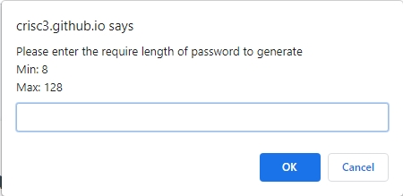

# Password Generator

## Description
The Password Generator application allows users to generate random passwords based on the site selection.

## Screenshots
Full view  

Password Length Prompt  

Lowercase Prompt  

Uppercase Prompt  

Number Prompt  

Special Characters Prompt  

## Link
https://crisc3.github.io/PasswordGenerator/